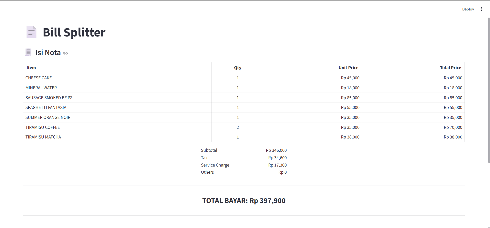
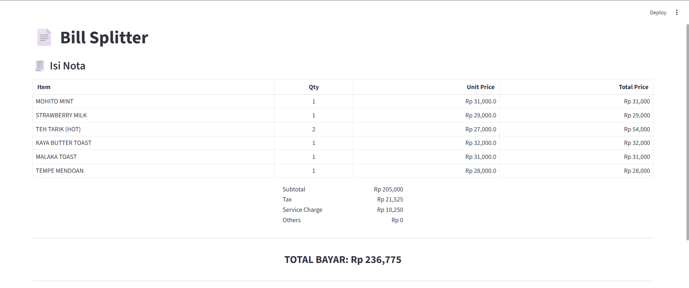

# AI Bill Splitter

Repositori ini berisi aplikasi **AI** untuk **membagi tagihan**, dibuat menggunakan **Python** dan **Streamlit**. Aplikasi ini bisa dijalankan dengan mudah di komputer Anda.  

**Cara kerja:** Pengguna mengunggah gambar nota → AI mengekstrak semua item pembelian → Pengguna membagi tagihan per orang berdasarkan menu yang dipilih.

## Installation

1. Install dependencies
pip install -r requirement.txt

2. Run Application
streamlit run app.py

3. Enter your **Google API Key**

## Sample Extractions

Berikut contoh data nota yang berhasil diekstrak oleh aplikasi:

## Evaluasi

1. Model sudah mampu membaca nota dengan baik. Mampu mengenali nama menu, qty, dan harga.
2. Aplikasi ini sudah mampu melakukan pembagian tagihan untuk masing-masing orang sesuai dengan menu yang mereka pesan.
3. Layout applikasi masih single-page dan sangat padat. Beberapa fitur masih dilakukan di satu halaman sehingga user akan kebingungan.
4. Refresh halaman yang mengapus seluruh progres jadi user harus mengulang proses dari awal.

## Ide Improvement untuk aplikasi

1. Memisahkan fitur hasil ekstraksi foto bill dengan fitur tambahkan orang agar lebih jelas dan mudah digunakan.
2. Menambahkan fitur untuk mengedit hasil pilih menu agar proses tidak terulang dari awal.

## Video Demo App

Video demo bisa dilihat di link google drive berikut [https://drive.google.com/file/d/1JgVAyOL1LKjRvvQPwfb22YW1js-QXskl/view?usp=drive_link](https://drive.google.com/file/d/1JgVAyOL1LKjRvvQPwfb22YW1js-QXskl/view?usp=drive_link)

